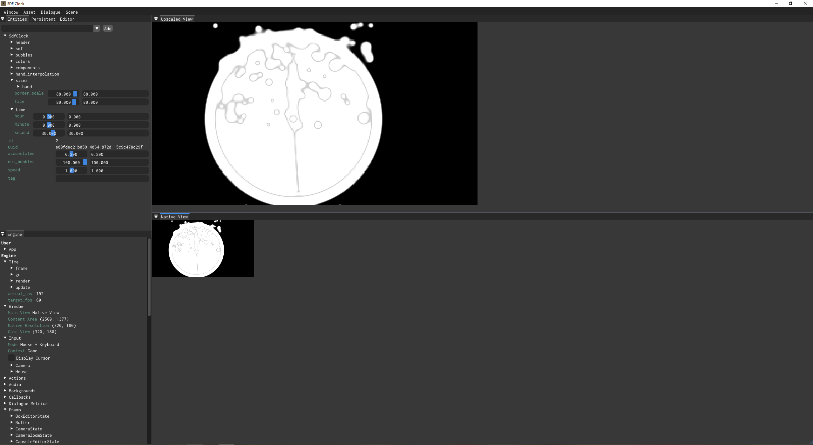

This is a clock rendered using combinations of SDF shapes. It's meant to show off a basic app, the immediate mode shape UI, and the SDF rendering.

Check out the following files, which are documented with information on how to use `doublenickel`:
- `source/main.cpp`
- `source/app/App.lua`
- `source/app/entities/SdfClock.lua`

